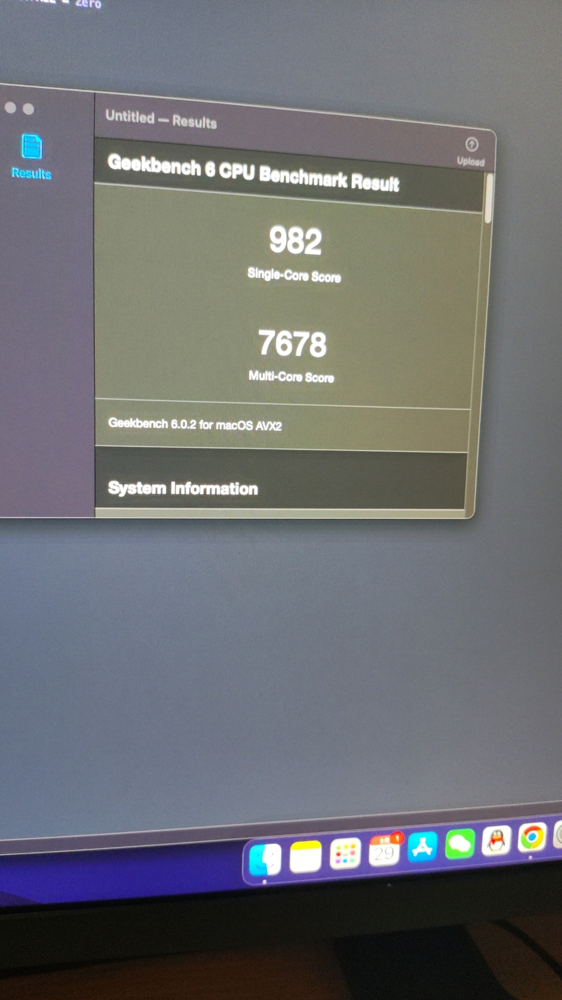
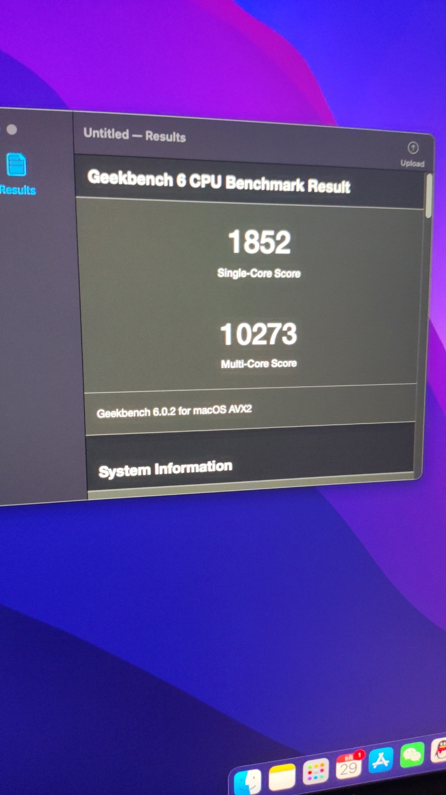

# EFI-MSI-B660M-MORTAR-WIFI-D4-I5-13400-RX580

#### 介绍
EFI

#### 硬件配置

| 配置 | 型号 |
| --- | --- |
| CPU | i5-13400 |
| 主板 | MSI-B660M-MORTAR-WIFI-D4  |
| 内存 | 威刚 16G DDR4 3200 * 2 |
| 显卡 | uhd730(未驱动)|蓝宝石RX580(免驱) |
| 硬盘 | 西数SN770 1TB |


#### 软件架构
1. OC:0.9.2
1. MacOS: Monterey 12.5.1 【[黑果小兵](https://blog.daliansky.net/macOS-Monterey-12.5.1-21G83-Release-version-with-OC-0.8.4-CLOVER-5148-and-FirPE-original-image.html)】


#### 已解决
1. 板载WIFI，蓝牙 已驱动
1. USB已定制
1. CPU大小核已驱动
2. 板载声卡已驱动
3. 板载有线已驱动

#### 未解决
1. 睡眠/唤醒 未解决(因为是台式机所以关闭了睡眠)
1. CPU温度读取不到（Intel® Power Gadget 这个软件读取得到温度，腾讯的Lemon不得行）
2. UHD730无法驱动


#### 异常
1. 出现过一次开机之后没有管它，等十多分钟用的时候电脑很卡，本来想看是不是显存没驱动起来，等打开“关于本机”查看时电脑又突然好了

#### 跑分
1. 未驱动大小核

1. 已驱动大小核


#### Win+Mac双系统解决Win系统时间时差问题
1. 在Windows下运行
```
Reg add HKLM\SYSTEM\CurrentControlSet\Control\TimeZoneInformation /v RealTimeIsUniversal /t REG_DWORD /d 1
```


教程参考：https://github.com/sqlsec/Hackintosh

初期EFI来源：https://github.com/AHREAL/Hackintosh-13400-B660M-RX580

在这个论坛上提了个问题，这个版主也没解决到
https://www.tonymacx86.com/threads/i-need-help-i-cannot-obtain-cpu-temperature-for-my-intel-i5-13400.325818/

希望哪个大佬能看到并解决这个问题，我现在放弃抵抗了，又不是不能用！！！
